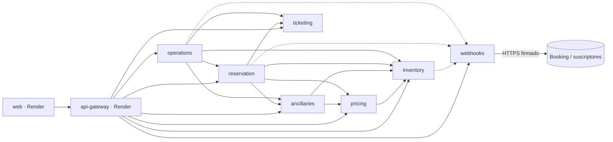
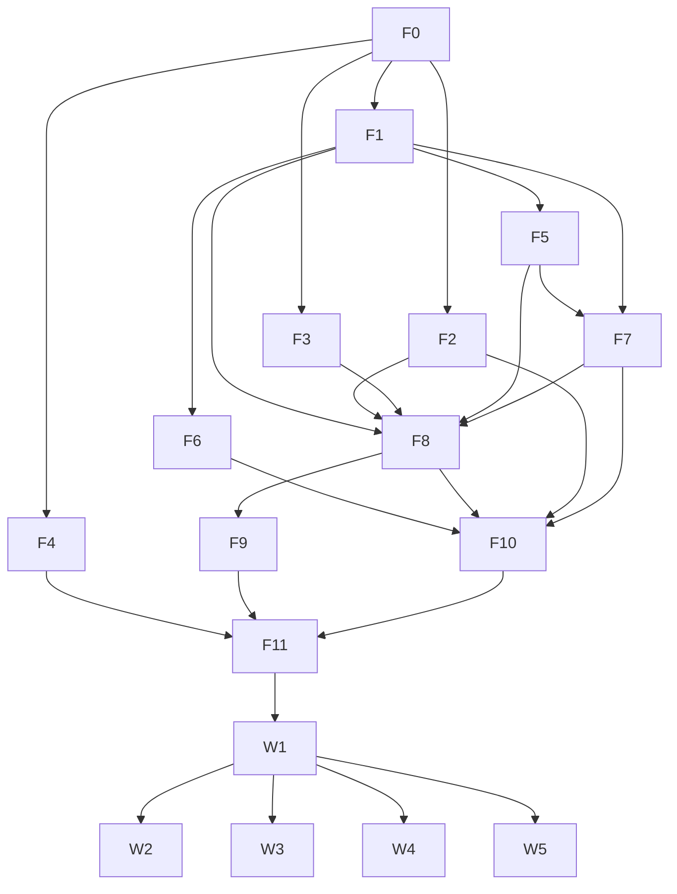

# PLAN.md — Flight Platform

**Versión:** 3.0 · **Fecha:** 2026-10-06 · **Ubicación en el repo:** `docs/audit/context/PLAN.md`

**Fuentes de verdad (en este orden):**

1. `contracts/openapi/vuelos-openapi.yaml` — contrato público "GDS Flight Core API" v1.5.0.0. **No se modifica.** Cumplirlo es la condición para integrarse con Booking.
2. Este documento — decisiones técnicas, de negocio y de seguridad, fases, tareas y pruebas.
3. `docs/audit/context/investigacion-base.md` — referencia funcional: flujos, máquinas de estado (§14), invariantes (§15) y casos de borde (§16). Los IDs `Q-*`, `GAP-*`, `INV-*`, `EC-*` de este plan vienen de ese documento.

---

## 1. Decisiones

Durante la construcción estas decisiones son finales. Si aparece algo no cubierto, el developer:

1. toma la opción más simple que cumpla el contrato y la seguridad base (§2);
2. la registra en un ADR (§4.3);
3. continúa.

### 1.1 Decisiones técnicas

| ID | Decisión |
| --- | --- |
| D-01 | **Repositorio único con proyectos independientes** (npm workspaces). Cada microservicio es un proyecto NestJS propio en `microservices/<servicio>/`, con su `package.json`, `Dockerfile`, esquema Prisma, pruebas y pipeline. La plataforma vive en `platform/` (`api-gateway` y `web`). Lo compartido está en `packages/contracts` (código generado de `.proto` y tipos del OpenAPI) y `packages/shared` (errores, seguridad, utilidades). Node 20 LTS, TypeScript estricto. |
| D-02 | **gRPC** con `@nestjs/microservices` + `@grpc/grpc-js`. Los `.proto` viven en `contracts/proto/`. Tipos generados con `ts-proto` (`nestJs=true`). Tras el freeze de la Fase 0 solo se permiten cambios aditivos. |
| D-03 | **Supabase Postgres**: un proyecto, un esquema y **un rol de base de datos por servicio** (`inventory`, `pricing`, `ancillaries`, `reservation`, `ticketing`, `operations`, `webhooks`, `gateway`). Prisma por servicio. Ningún servicio accede al esquema de otro; las referencias entre servicios son IDs opacos sin FK. |
| D-04 | **Comunicación síncrona por gRPC**: (a) los holds expiran de forma perezosa (`now ≥ expiresAt` ⇒ `EXPIRED`) dentro de cada transacción; (b) las tareas periódicas (barrido de holds, reanudación de reservas pendientes, despacho de webhooks) son RPCs de mantenimiento que el Gateway dispara cada minuto; (c) los eventos públicos se envían a Webhooks con `PublishEvent`, que los persiste y entrega con reintentos. La corrección del negocio no depende del scheduler. |
| D-05 | **Despliegue:** microservicios en **Google Cloud Run** (gRPC sobre HTTP/2, `--use-http2`); imágenes en **Artifact Registry**; secretos en **Secret Manager**. **API Gateway y frontend en Render.** Región recomendada para todo: US East. |
| D-06 | **Dinero:** entero en unidades menores internamente (`amountMinor`); string decimal con 2 decimales en REST (`"123.45"`). Moneda única **USD**. Nunca `float`. |
| D-07 | **Errores:** catálogo único en `packages/shared` (§1.4). Los servicios lanzan `DomainError(code)`; un filtro lo convierte en `RpcException` con el `code` en `details`; el Gateway lo traduce a `ProblemDetails` (`application/problem+json`). |
| D-08 | **Idempotencia HTTP** en el Gateway (tabla `gateway.idempotency_keys`, 24 h). Cada servicio que muta guarda además su clave de dominio con restricción `UNIQUE`. |
| D-09 | **Rate limit** con `@nestjs/throttler` en memoria, por `X-Device-Fingerprint` en rutas públicas y por `sub` en protegidas. |
| D-10 | **Observabilidad:** `nestjs-pino` (logs JSON con redacción de PII) y `X-Correlation-Id` propagado como metadata gRPC. Health check gRPC estándar (`grpc.health.v1`) para las sondas de Cloud Run. |
| D-11 | **Payment API simulada:** puerto `PaymentVerifier` con `FakePaymentVerifier` que decide por prefijo de `paymentReference`: `pay_ok_*` autorizado, `pay_pending_*` pendiente, `pay_invalid_*` → `PAYMENT_REFERENCE_INVALID`, `pay_denied_*` → `PAYMENT_NOT_AUTHORIZED`, `pay_mismatch_*` → `AMOUNT_MISMATCH`. |
| D-12 | **Arquitectura hexagonal** por servicio: `domain/` (entidades, reglas, errores; sin Nest ni Prisma), `application/` (casos de uso, puertos, validación de entrada), `infrastructure/` (controlador gRPC, repositorios Prisma, clientes gRPC). ESLint `no-restricted-imports` impide que `domain/` importe `@nestjs/*`, `@prisma/*` o `infrastructure/`. |
| D-13 | **Pruebas:** Jest. Unitarias (dominio y casos de uso, con reloj inyectable), integración por servicio contra Postgres local en Docker, pruebas de seguridad por servicio (§2.5), validación de request/response contra el OpenAPI en el Gateway (`express-openapi-validator`), journeys E2E en la Fase 11. |
| D-14 | **CI/CD:** GitHub Actions por proyecto, con filtro de rutas. En PR: `lint + test + build + npm audit --audit-level=high`. En `main`: imagen → Artifact Registry → `gcloud run deploy`. Autenticación a GCP con Workload Identity Federation. Gateway y frontend: auto-deploy de Render desde `main`. |
| D-15 | **Frontend:** React + Vite + TypeScript, TanStack Query, React Router, tipos del OpenAPI (`openapi-typescript`), Supabase Auth. Consume solo el Gateway. |
| D-16 | **Dependencias blandas de notificación:** cada servicio publica eventos a través de un puerto `EventPublisher`. Mientras Webhooks no esté desplegado se usa `NoopEventPublisher`, así ningún servicio espera a Webhooks para construirse. |

### 1.2 Valores de negocio

Todos son variables de entorno con este valor por defecto (§8).

| Q | Tema | Decisión |
| --- | --- | --- |
| Q-001 | Inventario | Propio (aerolínea ficticia, código configurable, p. ej. `FP`). Sin codeshare |
| Q-002 | Moneda | USD fijo, sin campos nuevos en `/search` |
| Q-003 / Q-004 | TTL de oferta / hold | 15 min / 20 min |
| Q-006 | 201 vs 202 en `POST /bookings` | 201 si la emisión termina en la petición; 202 si el pago queda pendiente o la emisión falla y se reintenta |
| Q-007 | E-ticket | Prefijo de 3 dígitos (`999`) + secuencia de 10 dígitos |
| Q-008 | Overbooking | No |
| Q-009 | Asiento | Gratuito |
| Q-010 | Edades | INFANT < 2, CHILD 2–11, YOUTH 12–15, ADULT ≥ 16 (a la fecha del último segmento). Infante sin asiento ni equipaje facturado propio |
| Q-011 | Máximo de pasajeros | 9 con asiento |
| Q-012 / Q-013 | Check-in | Ventana 48 h – 60 min; todos los elegibles; resultado mixto ⇒ `COMPLETED` con pasajeros `FAILED` |
| Q-015 | Reembolso monetario | Fuera de alcance; se informa `refundAmount` en `booking.cancelled` |
| Q-016 | Horarios, tarifas, cambios operativos | Seeds + rutas `/admin/*` del Gateway (rol `admin`) |
| Q-018 | Webhooks | Por owner; HMAC-SHA256 en `X-Flight-Signature: t=<unix>,v1=<hex>` sobre `"<t>.<body>"`; 6 reintentos (1, 5, 15, 60, 180, 720 min) |
| Q-019 / Q-025 / Q-028 | Visibilidad | Cada `sub` ve solo lo suyo (incluido `?pnr`); el owner del hold debe ser el de la reserva |
| Q-020 | Cambio de fecha | Por itinerario completo; tickets nuevos, anteriores `VOIDED` |
| Q-026 | Seat map antes de comprar | Todas las cabinas de la oferta |
| Q-027 / Q-030 | Total esperado y `AMOUNT_MISMATCH` | `lockedPrice` + equipaje extra × `extraCheckedBaggagePrice`; debe coincidir exacto con lo autorizado |
| Q-032 | Multidestino con tramo vacío | 0 resultados |
| Q-033 | Reembolso por cancelación | Reembolsable: total − penalidad (0 USD por defecto). No reembolsable: solo tasas |
| Q-034 | Barcode | `QR` con cadena tipo BCBP |
| Q-036 | Umbral de retraso | 15 min |
| Q-037 | Cancelar en `CHANGE_PENDING`/`TICKET_ISSUING` | No (409 `BOOKING_NOT_CONFIRMED`) |
| Q-038 | `grandTotal` | Suma, por itinerario, de la opción más barata |
| Q-039 | Precio distinto al retener | Se acepta y se devuelve en `lockedPrice` |
| Q-042 | Reintentos de emisión | 3; agotados ⇒ `FAILED`, tickets `VOIDED`, inventario y asientos liberados |
| Q-044 / Q-045 | Cutoff de equipaje / TTL de `ChangeOffer` y `CancellationQuote` | 4 h / 15 min |
| — | Conexiones y cargo por cambio | Máximo 1 escala, MCT 60 min; `CHANGE_FEE` 50 USD por pasajero |

### 1.3 Comportamiento ante huecos del contrato (sin modificar el OpenAPI)

| GAP | Comportamiento |
| --- | --- |
| GAP-018 | Sin token o token inválido ⇒ 401; rol o scope insuficiente ⇒ 403; ambos con `code: VALIDATION_FAILED` |
| GAP-031 | Hold expirado en `POST /bookings` ⇒ 410 `OFFER_NO_LONGER_AVAILABLE`. Misma `Idempotency-Key` con otro cuerpo ⇒ 422 `VALIDATION_FAILED`. Key en curso ⇒ 409 `VALIDATION_FAILED` + `Retry-After: 1`. Servicio interno caído ⇒ 503 `RATE_LIMIT_EXCEEDED` + `Retry-After: 5` |
| GAP-011 | DELETE de hold `CONSUMED` ⇒ 409 `OFFER_NO_LONGER_AVAILABLE`; ya liberado o expirado ⇒ 204 |
| GAP-019 | `/bookings/{id}/*` inexistente o ajeno ⇒ 404 |
| GAP-020 | 202 sin cuerpo en baggage, date-change y cancel |
| GAP-024 | `QUOTE_EXPIRED` en `/cancel` ⇒ 409 |
| GAP-025 | `secret` enmascarado en lecturas (`"****" + últimos 4`). `hold.expired`: `data = { status: "EXPIRED" }`. `flight.*`: un evento por reserva afectada |
| GAP-027 | `POST check-in` sin cuerpo ⇒ check-in de todos los elegibles |
| GAP-021 | La compra de equipaje es síncrona y responde 200 |

### 1.4 Catálogo de errores

| `code` | HTTP | gRPC |
| --- | --- | --- |
| `VALIDATION_FAILED` | 400 | `INVALID_ARGUMENT` |
| `SEAT_TAKEN`, `OFFER_NO_LONGER_AVAILABLE`, `BOOKING_NOT_CONFIRMED`, `ALREADY_CANCELLED`, `TICKET_ALREADY_ISSUED`, `BAGGAGE_LIMIT_EXCEEDED`, `FARE_NOT_CHANGEABLE`, `FLIGHT_ALREADY_DEPARTED`, `CUTOFF_PASSED`, `CHECK_IN_NOT_AVAILABLE`, `QUOTE_EXPIRED` (en `/cancel`) | 409 | `FAILED_PRECONDITION` (`ABORTED` para `SEAT_TAKEN`) |
| `CHANGE_OFFER_EXPIRED`, hold expirado | 410 | `FAILED_PRECONDITION` |
| `INFANT_SEAT_NOT_ALLOWED`, `SEAT_CABIN_MISMATCH`, `PAYMENT_REFERENCE_INVALID`, `PAYMENT_NOT_AUTHORIZED`, `AMOUNT_MISMATCH`, `CHECK_IN_FAILED` | 422 | `FAILED_PRECONDITION` |
| `BOARDING_PASS_NOT_AVAILABLE`, `FLIGHT_STATUS_NOT_AVAILABLE`, recurso inexistente o ajeno | 404 | `NOT_FOUND` |
| `RATE_LIMIT_EXCEEDED` | 429 / 503 | `RESOURCE_EXHAUSTED` / `UNAVAILABLE` |
| Autenticación / autorización | 401 / 403 (`VALIDATION_FAILED`) | `UNAUTHENTICATED` / `PERMISSION_DENIED` |
| `PNR_CREATION_FAILED`, `TICKET_ISSUANCE_FAILED` | En `failureReason` del ticket o estado `FAILED` de la reserva | `INTERNAL` |

El HTTP final lo decide el Gateway por `code` + operación (por eso `OFFER_NO_LONGER_AVAILABLE` es 409 en `/offers/hold` y 410 en `/bookings`).

---

## 2. Seguridad (Security First)

Cada fase tiene un bloque **Seguridad** con tareas y pruebas propias. Una fase no se cierra si sus pruebas de seguridad no pasan.

Los controles se limitan a lo esencial:

- autenticación OAuth 2.0 / JWT;
- HTTPS en todo tráfico;
- validación y saneamiento de entradas;
- autorización por rol y por owner en las tres capas (cliente, Gateway, servicios);
- secretos fuera del código;
- mínimo privilegio en base de datos y nube.

### 2.1 Principios

1. **Denegar por defecto.** Toda ruta y todo RPC exige autenticación salvo los explícitamente públicos (`/search`, `/offers/{id}/seatmap`, `/flights/{n}/status`, health).
2. **Defensa en profundidad.** El Gateway autoriza, pero cada servicio vuelve a filtrar por `owner_id` y a verificar el rol en RPCs administrativos. El cliente solo oculta lo que no corresponde; nunca es la barrera de seguridad.
3. **Validar en la frontera, parametrizar en la base.** Toda entrada se valida contra un esquema (OpenAPI en el Gateway, Zod en cada RPC). Todo acceso a datos usa Prisma o SQL parametrizado; nunca concatenación.
4. **Nada sensible sale ni se registra.** Sin stack traces en respuestas; sin PII ni secretos en logs; secretos de webhook nunca devueltos en claro.

### 2.2 Autenticación (OAuth 2.0 + JWT)

| Actor | Flujo OAuth 2.0 | Emisor del token |
| --- | --- | --- |
| Usuario final y administrador (frontend propio) | Authorization Code con PKCE | Supabase Auth |
| Socio B2B (p. ej. Booking) | Client Credentials | Authorization Server del socio, registrado en `JWT_ISSUERS` del Gateway |
| Desarrollo y pruebas | — | `scripts/dev-token.ts` (solo local y CI; deshabilitado en producción) |

El Gateway valida en cada request:

- firma por JWKS del emisor, con algoritmos permitidos `RS256` / `ES256` (rechaza `none` y `HS*`);
- `iss` dentro de la lista configurada;
- `aud`;
- `exp` y `nbf`, con tolerancia de 30 s.

`ownerId` = `sub` siempre. El rol y los scopes salen del token: claim `app_role` y `scope`, inyectados por el *Custom Access Token Hook* de Supabase. Para tokens B2B, el rol `partner` se asigna por emisor.

### 2.3 Roles y permisos

| Rol | Cómo se obtiene | Scopes | Puede |
| --- | --- | --- | --- |
| `anonymous` | Sin token | — | Buscar vuelos, ver seat map, consultar estado de vuelo |
| `customer` | Registro en Supabase Auth (rol por defecto) | `flights:read`, `flights:hold`, `flights:book`, `flights:cancel` | Operar holds, reservas, postventa, tickets y check-in **propios** |
| `partner` | Token client credentials de un emisor B2B registrado | Los de `customer` + `flights:webhooks` | Lo mismo que `customer` sobre recursos de su propio `sub`; gestionar sus webhooks |
| `admin` | Asignado manualmente en `app_metadata` de Supabase | Los de `customer` + `flights:webhooks` + `flights:admin` | Lo anterior + rutas `/admin/*` (vuelos, tarifas, actualizaciones operacionales). **No** ve reservas ajenas |

Dónde se aplica cada control:

| Capa | Control |
| --- | --- |
| Cliente (React) | Guardas de ruta por sesión y rol; menús y acciones visibles según rol. Solo experiencia de usuario |
| Gateway | `JwtAuthGuard` → `RolesGuard` / `ScopesGuard` por operación (scopes del OpenAPI). Propaga `x-owner-id`, `x-role` y `x-correlation-id` como metadata gRPC |
| Servicios | Interceptor que exige `x-internal-key` válida (rechaza llamadas que no vienen del Gateway u otro servicio). Repositorios owner-scoped: toda consulta de datos de usuario incluye `owner_id`. RPCs administrativos exigen `x-role = admin` |
| Base de datos | Un rol de Postgres por servicio con permisos solo sobre su esquema. Esquemas propios no expuestos por la Data API de Supabase |

### 2.4 Controles base por capa

| Área | Control esencial |
| --- | --- |
| HTTPS | Render y Cloud Run terminan TLS. El Gateway confía en el proxy (`trust proxy`) y rechaza peticiones con `X-Forwarded-Proto: http`. Cabecera HSTS. Clientes gRPC internos con TLS (`*.a.run.app:443`). Webhooks solo a URLs `https` en producción |
| Cabeceras y CORS | `helmet` en el Gateway; CORS con lista blanca (`CORS_ORIGINS`) limitada al dominio del frontend; frontend con CSP básica vía cabeceras de Render |
| Entrada | Gateway: `express-openapi-validator` (tipos, patrones IATA, uuid, enums, `additionalProperties: false`) y límite de cuerpo de 100 kB. Servicios: esquema Zod por RPC (longitudes máximas, enums, formatos); strings recortados; campos desconocidos rechazados |
| Salida | Respuestas construidas desde DTOs explícitos (nunca la entidad o fila completa); errores solo como `ProblemDetails` sin detalles internos; React sin `dangerouslySetInnerHTML` |
| Secretos | Secret Manager (Cloud Run) y variables de entorno de Render. `.env` en `.gitignore`; `.env.example` sin valores reales. Una service account de runtime por servicio, con acceso solo a sus propios secretos |
| Abuso | Rate limit (D-09). Validación SSRF de URLs de webhook (rechaza `localhost`, IPs privadas, link-local y loopback, también tras resolver DNS) |
| Dependencias | `npm audit --audit-level=high` bloquea el PR |
| Logs | Redacción de `documentNumber`, `email`, `phone`, `firstName`, `lastName`, `authorization`, `secret`, `paymentReference` |

### 2.5 Pruebas de seguridad mínimas

Se aplican a cada servicio y al Gateway; en las fases aparecen como tareas `*-SEC`.

| Prueba | Resultado esperado |
| --- | --- |
| RPC sin `x-internal-key` o con una incorrecta | `UNAUTHENTICATED` |
| Entrada inválida (formato, longitud, enum, campo extra) | `INVALID_ARGUMENT` / 400 |
| Recurso de otro owner | `NOT_FOUND` / 404 (nunca 403, para no revelar existencia) |
| RPC o ruta administrativa con rol `customer` | `PERMISSION_DENIED` / 403 |
| Error interno forzado | Respuesta sin stack trace ni mensaje interno |
| Log de una operación con PII | Campos sensibles redactados |

---

## 3. Arquitectura

### 3.1 Servicios

| Servicio | Directorio | Puerto local | Esquema | Responsabilidad | Llama a (gRPC) |
| --- | --- | --- | --- | --- | --- |
| Inventory | `microservices/inventory-service` | 50051 | `inventory` | `FlightInstance`, capacidad por cabina, `InventoryHold` | webhooks (blanda) |
| Pricing | `microservices/pricing-service` | 50052 | `pricing` | Tarifas y brands, búsqueda, `Offer`, `PriceLock`, `ChangeOffer`, cotización de cancelación, precio de equipaje | inventory |
| Ancillaries | `microservices/ancillaries-service` | 50053 | `ancillaries` | Seat map, `SeatAssignment`, equipaje | inventory, pricing |
| Reservation | `microservices/reservation-service` | 50054 | `reservation` | `FlightReservation` (`/bookings`), PNR, pasajeros, orquestación de compra, cambio y cancelación, verificación de pago, postventa de `/bookings/{id}/*` | inventory, pricing, ancillaries, ticketing, webhooks |
| Ticketing | `microservices/ticketing-service` | 50055 | `ticketing` | `Ticket`, cupones, numeración, emisión, void, refund, reemisión | — |
| Operations | `microservices/operations-service` | 50056 | `operations` | Estado operacional, check-in, boarding pass | inventory, reservation, ticketing, ancillaries, webhooks |
| Webhooks | `microservices/webhooks-service` | 50057 | `webhooks` | Suscripciones, cola de entregas, firma, reintentos | — (HTTP saliente) |
| API Gateway | `platform/api-gateway` (Render) | 3000 | `gateway` | REST `/flights/v1`, autenticación y autorización, idempotencia, rate limit, mapeo de errores, scheduler, rutas `/admin` | todos |
| Web | `platform/web` (Render) | 5173 | — | Frontend React | Gateway |

### 3.2 Grafo de dependencias en tiempo de ejecución



El grafo es acíclico. Las flechas punteadas son dependencias blandas (D-16).

### 3.3 Contrato interno gRPC (se congela en la Fase 0)

Paquetes `flightplatform.<servicio>.v1`. Metadata en toda llamada:

- `x-internal-key`
- `x-correlation-id`
- `x-owner-id` (cuando aplica)
- `x-role` (cuando aplica)

| Paquete | RPCs |
| --- | --- |
| `common.v1` | Mensajes: `Money{currency, amount_minor}`, `PassengerMix`, `CabinClass`, `PassengerType`, `PageRequest/PageResponse`, `ItinerarySnapshot`, `SegmentSnapshot` |
| `inventory.v1` | `UpsertFlightInstance`*, `ListFlightInstances`, `GetFlightInstance`, `FindFlightInstance`, `QueryAvailability`, `CreateHold`, `GetHold`, `ReleaseHold`, `ConsumeHold`, `ReleaseReservedInventory`, `CloseFlightInstance`*, `ExpireHolds`† |
| `pricing.v1` | `UpsertFare`*, `ListFares`*, `SearchOffers`, `ResolveSegment`, `HoldOffer`, `GetOfferHold`, `ReleaseOfferHold`, `GetPriceLock`, `QuoteChange`, `GetChangeOffer`, `MarkChangeOfferUsed`, `QuoteCancellation`, `GetBaggagePrice` |
| `ancillaries.v1` | `GetSeatMapForOffer`, `ReserveSeats`, `ConfirmSeats`, `ReleaseSeats`, `AssignSeatAtCheckIn`, `GetAssignments`, `ReserveBaggage`, `GetBaggageOptions`, `PurchaseBaggage`, `ReleaseAll` |
| `ticketing.v1` | `IssueTickets`, `VoidTickets`, `RefundTickets`, `ReissueTickets`, `ListTickets`, `GetTicket`, `GetCouponsForBooking` |
| `reservation.v1` | `CreateReservation`, `GetReservation`, `ListReservations`, `GetReservationSnapshot`, `ListReservationsByFlightInstance`, `GetBaggageOptions`, `AddBaggage`, `SearchDateChange`, `ConfirmDateChange`, `GetCancellationQuote`, `CancelReservation`, `ResumePending`† |
| `operations.v1` | `GetFlightStatus`, `RecordOperationalUpdate`*, `CheckIn`, `ListBoardingPasses` |
| `webhooks.v1` | `CreateSubscription`, `ListSubscriptions`, `DeleteSubscription`, `PublishEvent`, `DispatchPending`† |

\* Requiere `x-role = admin`. † Mantenimiento: solo lo invoca el scheduler del Gateway con rol técnico `system`.

### 3.4 Mapeo contrato → servicio

| OP | Método y path | Acceso | Idem. | RPC destino |
| --- | --- | --- | --- | --- |
| OP-01 | `POST /search` | pública + fingerprint | — | `pricing.SearchOffers` |
| OP-02 | `GET /offers/{offerId}/seatmap` | pública | — | `ancillaries.GetSeatMapForOffer` |
| OP-03 | `POST /offers/hold` | `flights:hold` | Sí | `pricing.HoldOffer` |
| OP-04 | `GET /offers/hold/{holdId}` | `flights:read` | — | `pricing.GetOfferHold` |
| OP-05 | `DELETE /offers/hold/{holdId}` | `flights:hold` | — | `pricing.ReleaseOfferHold` |
| OP-06 | `GET /bookings` | `flights:read` | — | `reservation.ListReservations` |
| OP-07 | `POST /bookings` | `flights:book` | Sí | `reservation.CreateReservation` |
| OP-08 | `GET /bookings/{bookingId}` | `flights:read` | — | `reservation.GetReservation` |
| OP-09 | `GET /bookings/{id}/baggage-options` | `flights:read` | — | `reservation.GetBaggageOptions` |
| OP-10 | `POST /bookings/{id}/baggage` | `flights:book` | Sí | `reservation.AddBaggage` |
| OP-11 | `POST /bookings/{id}/date-change/search` | `flights:read` | — | `reservation.SearchDateChange` |
| OP-12 | `POST /bookings/{id}/date-change` | `flights:book` | Sí | `reservation.ConfirmDateChange` |
| OP-13 | `GET /bookings/{id}/cancellation-quote` | `flights:read` | — | `reservation.GetCancellationQuote` |
| OP-14 | `POST /bookings/{id}/cancel` | `flights:cancel` | Sí | `reservation.CancelReservation` |
| OP-15 | `GET /webhooks` | `flights:webhooks` | — | `webhooks.ListSubscriptions` |
| OP-16 | `POST /webhooks` | `flights:webhooks` | — | `webhooks.CreateSubscription` |
| OP-17 | `DELETE /webhooks/{id}` | `flights:webhooks` | — | `webhooks.DeleteSubscription` |
| OP-18 | `GET /bookings/{id}/tickets` | `flights:read` | — | `ticketing.ListTickets` |
| OP-19 | `GET /bookings/{id}/tickets/{ticketId}` | `flights:read` | — | `ticketing.GetTicket` |
| OP-20 | `POST /bookings/{id}/check-in` | `flights:book` | — | `operations.CheckIn` |
| OP-21 | `GET /bookings/{id}/boarding-passes` | `flights:read` | — | `operations.ListBoardingPasses` |
| OP-22 | `GET /flights/{flightNumber}/status` | pública | — | `operations.GetFlightStatus` |
| OP-23 | Callback `WebhookPayload` | firma HMAC | `eventId` | `webhooks-service` (HTTP saliente) |

Eventos públicos por emisor:

- **Reservation:** `booking.confirmed`, `booking.failed`, `booking.changed`, `booking.cancelled`, `booking.baggage_added`, `booking.ticket_issuing`, `booking.ticket_issued`, `booking.ticket_failed`.
- **Operations:** `booking.checked_in`, `flight.schedule_changed`, `flight.cancelled`.
- **Inventory:** `hold.expired`.

### 3.5 Estructura del repositorio

```text
flight-platform/
├── AGENTS.md                         # reglas de los agentes developer y auditor (§4)
├── BACKLOG.md
├── README.md
├── package.json                      # npm workspaces: packages/*, microservices/*, platform/*
├── contracts/
│   ├── openapi/vuelos-openapi.yaml   # contrato público (no se edita)
│   └── proto/flightplatform/<paquete>/v1/*.proto
├── packages/
│   ├── contracts/                    # generado: ts-proto + openapi-typescript (no se edita a mano)
│   └── shared/                       # errores y catálogo, Money, Clock, seguridad (interceptor
│                                     # de llave interna, contexto owner/rol, Zod helpers),
│                                     # cliente gRPC factory, logger con redacción, health
├── microservices/                    # cada uno es un proyecto NestJS independiente
│   ├── inventory-service/
│   │   ├── package.json  Dockerfile  .env.example  nest-cli.json  tsconfig.json
│   │   ├── prisma/{schema.prisma, migrations/, seed.ts}
│   │   ├── src/{domain/, application/, infrastructure/{grpc,persistence,clients}/, main.ts}
│   │   └── test/{unit/, integration/, security/}
│   ├── pricing-service/   ancillaries-service/   reservation-service/
│   └── ticketing-service/ operations-service/    webhooks-service/
├── platform/
│   ├── api-gateway/                  # NestJS HTTP (Render)
│   └── web/                          # React + Vite (Render)
├── infra/
│   ├── docker-compose.yml            # Postgres local (+ servicios opcionales)
│   ├── db/roles.sql                  # esquemas y roles por servicio
│   └── scripts/                      # gen-contracts.sh, dev-token.ts, smoke-grpc.sh
├── docs/
│   ├── dev/
│   │   ├── adr/                      # ADRs del developer
│   │   └── progress/                 # una bitácora por sesión de cada agente
│   └── audit/
│       ├── context/                  # PLAN.md, investigacion-base.md, guías para el auditor
│       └── audits/                   # informes del auditor, por fase
└── .github/workflows/                # un workflow por proyecto (filtro de rutas)
```

Cada proyecto de `microservices/` y `platform/` se instala, prueba, construye y despliega por separado:

```bash
npm run test  -w microservices/inventory-service
npm run build -w microservices/inventory-service
```

Su imagen Docker solo incluye su propio código y los dos paquetes compartidos.

---

## 4. Forma de trabajo: agente developer y agente auditor

### 4.1 Roles

| Agente | Hace | No hace |
| --- | --- | --- |
| **Developer** | Implementa las tareas de una fase en orden de dependencias; escribe y ejecuta la prueba de cada tarea; registra decisiones en ADRs; documenta su sesión; corrige los hallazgos de auditoría | Auditar su propio trabajo; cambiar el contrato público; saltarse o debilitar pruebas |
| **Auditor** | Verifica que lo construido corresponde a lo pedido en el plan y que funciona: ejecuta las pruebas, revisa el checklist de cierre y las pruebas de seguridad; escribe el informe | Modificar código; proponer soluciones; exigir cosas que el plan no pide |

Son sesiones distintas. El auditor no lee el razonamiento del developer, solo el plan, el código, los ADRs y la bitácora.

### 4.2 Flujo por fase

```text
Developer                                   Auditor
─────────                                   ───────
1. Crea docs/dev/progress/<sesión>.md
2. Lee la fase en PLAN.md y los ADRs previos
3. Por cada tarea (orden de "Depende"):
   implementa → ejecuta su prueba → marca ✔ en la bitácora
4. Escribe ADR si tomó decisiones
5. Corre checklist de cierre
6. Bitácora: "Listo para auditoría" ───────► 7. Crea su propia bitácora de sesión
                                             8. Lee docs/audit/context + fase + ADRs
                                             9. Ejecuta pruebas y checklist (clon limpio)
                                            10. Escribe docs/audit/audits/<FASE>/audit-<n>.md
                                                 ├── APROBADO → fase cerrada
11. Lee el informe, corrige ◄──────────────────── └── RECHAZADO → hallazgos
12. Vuelve a 5
```

**Granularidad:** se audita por **fase completa**. La Fase 11 se audita por bloque de rutas. El developer no espera auditoría entre tareas: la prueba de cada tarea es su propia verificación.

### 4.3 Documentos

| Ruta | Quién escribe | Contenido |
| --- | --- | --- |
| `docs/dev/adr/` | Developer | Un ADR por cada decisión de construcción que no esté en este plan, o que lo concrete de forma relevante (p. ej. diseño de una tabla, una librería elegida, una regla interpretada). Nombre: `ADR-<FASE>-<NN>-<slug>.md` |
| `docs/dev/progress/` | Developer **y** auditor | Una bitácora por sesión, creada al inicio. Nombre: `<AAAA-MM-DD>_<dev\|audit>_<FASE>_<n>.md` |
| `docs/audit/context/` | Humano | `PLAN.md` (este documento), `investigacion-base.md` y cualquier aclaración para el auditor sobre lo esperado |
| `docs/audit/audits/` | Auditor | `<FASE>/audit-<n>.md`: veredicto y hallazgos. Sin soluciones |

**Plantilla ADR** (máximo una página):

```markdown
# ADR-F1-01 — <título>
- Estado: Aceptado · Fecha: AAAA-MM-DD · Fase/Tarea: F1 / INV-06
## Contexto
<qué necesidad o ambigüedad apareció>
## Decisión
<qué se decidió>
## Consecuencias
<qué implica; qué queda fuera>
```

**Plantilla de bitácora de sesión:**

```markdown
# Sesión <dev|audit> — <FASE> — <AAAA-MM-DD> #<n>
- Agente: <developer|auditor> · Inicio: <hora> · Commit inicial: <sha>
## Objetivo de la sesión
## Registro
| Hora | Tarea | Acción | Resultado de la prueba |
|------|-------|--------|------------------------|
## ADRs creados
## Pendientes / bloqueos
## Cierre
- Commit final: <sha> · Estado: <en curso | listo para auditoría | auditoría emitida>
```

**Plantilla de informe de auditoría** (breve, sin soluciones):

```markdown
# Auditoría <FASE> — #<n>
- Fecha: AAAA-MM-DD · Commit auditado: <sha> · Veredicto: APROBADO | RECHAZADO
## Verificaciones ejecutadas
| Verificación | Resultado |
|---|---|
| Pruebas de tareas (`npm test -w ...`) | ✔ / ✘ |
| Pruebas de seguridad (*-SEC) | ✔ / ✘ |
| Checklist de cierre | ✔ / ✘ |
## Hallazgos (bloquean)
| # | Tarea | Dónde (archivo:línea o comando) | Problema |
|---|---|---|---|
| H1 | INV-06 | src/application/create-hold.ts:42 | Con dos holds simultáneos por el último asiento ambos quedan HELD |
## Observaciones (no bloquean → BACKLOG)
```

### 4.4 Reglas que evitan el bucle de validación

1. **El auditor solo puede rechazar por:**
   - una prueba de tarea fallida;
   - una prueba de seguridad fallida;
   - un ítem del checklist de cierre incumplido;
   - una respuesta que no cumple el contrato OpenAPI;
   - una tarea del plan no implementada.

   Todo lo demás (estilo, refactors, mejoras, cosas que el plan no pide) va a "Observaciones" y no bloquea.
2. **Cada hallazgo es reproducible:** indica la tarea, el lugar exacto (archivo y línea, o comando) y el problema observado. Sin hallazgos vagos.
3. **El informe no incluye soluciones.** La corrección queda a criterio del developer.
4. **Máximo dos rechazos por fase.** Si la tercera auditoría también rechaza, decide el humano: acepta, ajusta la tarea o la mueve al BACKLOG.
5. **Las decisiones de §1 y §2 no se discuten en la auditoría.** Si el auditor cree que una decisión es incorrecta, lo anota como observación.
6. **Una fase aprobada no se reabre.** Un defecto descubierto después se corrige como tarea en la fase en curso.

### 4.5 `AGENTS.md` (contenido mínimo)

- Qué es el proyecto y dónde están las fuentes de verdad (§0 de este plan).
- Rol developer: §4.1, §4.2, plantillas de §4.3; ejecutar la prueba de cada tarea antes de marcarla; no tocar `contracts/openapi/`; no desactivar pruebas.
- Rol auditor: §4.1, §4.2, §4.4; verificar en clon limpio; informe con la plantilla.
- Comandos: instalar, levantar Postgres local, probar, construir y generar contratos.

---

## 5. Mapa de dependencias

### 5.1 Dependencias entre fases

"Empezar" indica lo mínimo para comenzar a construir; antes de que exista la dependencia real se trabaja contra un adaptador falso del puerto. "Cerrar" indica lo que debe estar desplegado para la integración real y la auditoría.

| Fase | Para empezar requiere | Para cerrar requiere | Se construye en paralelo con |
| --- | --- | --- | --- |
| **F0** Fundaciones | — | — | Nada (bloquea todo) |
| **F1** Inventory | F0 | F0 | F2, F3, F4, F5, F6, F7 |
| **F2** Ticketing | F0 | F0 | F1, F3, F4, F5, F6, F7 |
| **F3** Webhooks | F0 | F0 | F1, F2, F4, F5, F6, F7 |
| **F4** Gateway base | F0 | F0 | F1, F2, F3, F5, F6, F7 |
| **F5** Pricing | F0 | F1 | F1–F4, F6, F7 |
| **F6** Operations: estado de vuelo | F0 | F1 | F1–F5, F7 |
| **F7** Ancillaries | F0 | F1, F5 | F1–F6 |
| **F8** Reservation: compra y consultas | F0 | F1, F2, F3, F5, F7 | F6 |
| **F9** Reservation: postventa | F8 | F8 | F10 |
| **F10** Operations: check-in | F6, F8 | F2, F6, F7, F8 | F9 |
| **F11** Plataforma | F4 + el servicio de cada bloque (§5.2) | F1–F10 | Bloques entre sí |
| **W1** Web: base | F11 | F11 | — |
| **W2** Web: compra | W1 | W1 | W3, W4, W5 |
| **W3** Web: mis reservas | W1 | W1 | W2, W4, W5 |
| **W4** Web: día del vuelo | W1 | W1 | W2, W3, W5 |
| **W5** Web: backoffice y despliegue | W1 | W2, W3, W4 | W2, W3, W4 (el despliegue va al final) |

Las fases independientes son F1, F2, F3 y F4: solo dependen de F0. Las dependientes son:

- F5 depende de F1.
- F6 depende de F1.
- F7 depende de F1 y F5.
- F8 depende de F1, F2, F3, F5 y F7.
- F9 depende de F8.
- F10 depende de F2, F6, F7 y F8.
- F11 depende de todas.



### 5.2 Dependencias de los bloques de la Fase 11

| Bloque | Requiere cerradas | Paralelo con |
| --- | --- | --- |
| PLT-A Shopping (OP-01, OP-02) | F4, F5, F7 | Todos los bloques |
| PLT-B Hold (OP-03–05) | F4, F5 | Todos |
| PLT-C Reservas (OP-06–08) | F4, F8 | Todos |
| PLT-D Tickets (OP-18, OP-19) | F4, F2 (datos reales tras F8) | Todos |
| PLT-E Postventa (OP-09–14) | F4, F9 | Todos |
| PLT-F Check-in y estado (OP-20–22) | F4, F6, F10 | Todos |
| PLT-G Webhooks (OP-15–17) | F4, F3 | Todos |
| PLT-H Admin y operación | F4, F1, F5, F6 | Todos |
| PLT-I Journeys E2E y despliegue final | Bloques A–H | — |

Los bloques A, B, D, G y H pueden empezar en cuanto sus servicios cierren, antes que F8–F10.

### 5.3 Convenciones de las tablas de tareas

- **Prueba:** comprobación mínima para dar la tarea por hecha. Tipos:
  - U = unitaria
  - I = integración (Postgres local)
  - C = concurrencia
  - S = seguridad
  - K = contrato (validación contra el OpenAPI)
  - E = E2E
  - M = manual o smoke con un comando indicado
- **Depende:** tareas de la misma fase (o de otras fases, indicadas con su ID) que deben estar hechas antes. "—" significa que la tarea es independiente dentro de la fase y puede hacerse en paralelo con las demás que también tengan "—".

---

## 6. Fases

### FASE 0 — Fundaciones

**Depende de:** nada. **Bloquea:** todas las demás.
**Objetivo:** repositorio, contratos internos congelados, librería compartida con la seguridad base, infraestructura lista y pipeline de despliegue probado.

| ID | Tarea | Prueba | Depende |
| --- | --- | --- | --- |
| F0-01 | Repo con npm workspaces (`packages/*`, `microservices/*`, `platform/*`), TypeScript estricto, ESLint + Prettier, Jest, `.nvmrc` (Node 20), `.gitignore` con `.env*` salvo `.env.example` | M: `npm install` y `npm run lint` sin errores | — |
| F0-02 | Estructura `docs/` (§4.3), `AGENTS.md` (§4.5), `BACKLOG.md`; copiar este plan e `investigacion-base.md` a `docs/audit/context/` | M: rutas existen; `AGENTS.md` cubre §4.5 | — |
| F0-03 | `contracts/openapi/vuelos-openapi.yaml` + generación de tipos con `openapi-typescript` en `packages/contracts` | M: `npm run gen:contracts` genera y compila | F0-01 |
| F0-04 | `.proto` de los 8 paquetes (§3.3), con mensajes de respuesta mapeables 1:1 a los schemas del OpenAPI | M: revisión operación por operación contra §3.4, anotada en la bitácora | F0-01 |
| F0-05 | Generación con `ts-proto` (`nestJs=true`) en `packages/contracts`. **Freeze del contrato gRPC** | M: compila sin errores | F0-04 |
| F0-06 | `packages/shared`: `DomainError` + catálogo §1.4 | U: los 24 `code` del enum del OpenAPI están mapeados | F0-01 |
| F0-07 | `packages/shared`: filtro gRPC (dominio → `RpcException`) que nunca expone mensajes internos | U: un error no controlado produce `INTERNAL` con mensaje genérico | F0-06 |
| F0-08 | `packages/shared`: `Clock` inyectable, utilidades `Money` (minor ↔ `"0.00"`), health check gRPC reutilizable | U: conversión de dinero y reloj fijo | F0-01 |
| F0-09 | `packages/shared`: factory de clientes gRPC (TLS según `GRPC_TLS`, deadline 5 s, metadata automática) | U: la metadata saliente incluye llave interna, correlación, owner y rol | F0-01 |
| F0-10 | Regla ESLint `no-restricted-imports` para `**/domain/**` (D-12) | U: un archivo de prueba en `domain/` que importa `@nestjs/common` hace fallar el lint | F0-01 |
| F0-11 | `infra/docker-compose.yml` (Postgres 15) | M: `docker compose up` y conexión exitosa | — |
| F0-12 | Supabase: proyecto creado; URLs `DATABASE_URL` (pooler 6543, `pgbouncer=true&connection_limit=3`) y `DIRECT_URL` por servicio | M: conexión con cada rol | F0-SEC-04 |
| F0-13 | GCP: APIs (Run, Artifact Registry, Secret Manager, IAM Credentials), repositorio de imágenes, Workload Identity Federation con GitHub | M: `gcloud artifacts repositories list` muestra el repo | — |
| F0-14 | Plantilla `Dockerfile` multi-stage (`node:20-slim`, usuario no root) y workflow reutilizable `deploy-service.yml` | M: build local de la imagen de prueba | F0-01 |
| F0-15 | **Prueba del pipeline:** servicio "hello" con health check desplegado en Cloud Run | M: `grpcurl <svc>.a.run.app:443 grpc.health.v1.Health/Check` ⇒ `SERVING` | F0-08, F0-13, F0-14 |
| **Seguridad** | | | |
| F0-SEC-01 | `packages/shared`: interceptor de servidor que exige `x-internal-key` (comparación en tiempo constante) y construye el contexto `{ownerId, role, correlationId}` | S: sin llave o llave incorrecta ⇒ `UNAUTHENTICATED` | F0-09 |
| F0-SEC-02 | `packages/shared`: helpers `requireRole('admin' \| 'system')` y `validate(zodSchema)` para RPCs (rechaza campos desconocidos, recorta strings, límites de longitud) | U/S: rol incorrecto ⇒ `PERMISSION_DENIED`; entrada inválida ⇒ `INVALID_ARGUMENT` | F0-SEC-01 |
| F0-SEC-03 | `packages/shared`: logger `nestjs-pino` con la lista de redacción de §2.4 | U: un log con `documentNumber` y `email` sale redactado | F0-01 |
| F0-SEC-04 | `infra/db/roles.sql`: un esquema y un rol por servicio, `USAGE`/`CREATE` solo sobre su esquema, `REVOKE` de `anon` y `authenticated`; esquemas no añadidos a "Exposed schemas" de la Data API | S: el rol `svc_pricing` no puede leer `inventory.*`; la Data API con la anon key no ve los esquemas | — |
| F0-SEC-05 | Secretos: `INTERNAL_API_KEY` (32+ bytes aleatorios) en Secret Manager; service account de runtime por servicio con acceso solo a sus secretos; `.env.example` en cada proyecto | M: `gcloud secrets get-iam-policy` muestra solo la SA correspondiente | F0-13 |
| F0-SEC-06 | CI: `npm audit --audit-level=high` en el workflow base | M: el workflow falla con una dependencia vulnerable de prueba | F0-14 |
| F0-SEC-07 | `infra/scripts/dev-token.ts`: firma JWT RS256 con par de llaves local, `sub`, `app_role` y `scope` configurables; se niega a correr con `NODE_ENV=production` | U: el token generado valida con la llave pública | F0-01 |

**Checklist de cierre**

- `npm run build`, `npm run lint` y `npm test` verdes en todos los workspaces.
- Contrato gRPC congelado.
- Servicio "hello" en Cloud Run respondiendo `SERVING` y rechazando llamadas sin llave interna.
- Roles de base de datos aislados.

---

### FASE 1 — Inventory Service

**Depende de:** F0. **Paralelo con:** F2, F3, F4 (y el inicio de F5, F6, F7). **Bloquea:** el cierre de F5, F6, F7, F8.
**Capacidades:** CAP-13, base de CAP-03 y CAP-15.

| ID | Tarea | Prueba | Depende |
| --- | --- | --- | --- |
| INV-01 | Proyecto `microservices/inventory-service`: Nest, Prisma (`schema=inventory`, rol `svc_inventory`), servidor gRPC en `0.0.0.0:${PORT}`, health, interceptores de `shared` | M: arranca local y health ⇒ `SERVING` | F0 |
| INV-02 | Modelo y migración: `flight_instances`, `cabin_inventory` (sellable, held, sold), `holds` (owner_id, status, expires_at, UNIQUE (owner_id, idempotency_key)), `hold_lines`, `reserved_inventory` | I: migración aplica sobre base vacía | INV-01 |
| INV-03 | Seed: rutas de ejemplo (UIO–GYE, UIO–BOG, UIO–LIM, BOG–MIA, LIM–MAD, GYE–MIA), salidas diarias por 60 días, tres tipos de aeronave | I: el seed crea instancias consultables | INV-02 |
| INV-04 | Dominio: `FlightInstance`, `CabinCapacity` (`held + sold ≤ sellable`), `InventoryHold` con máquina BL §14.2 y estado efectivo por reloj | U: transiciones válidas e inválidas; `HELD` vencido ⇒ `EXPIRED` | INV-01 |
| INV-05 | Consultas: `QueryAvailability`, `ListFlightInstances`, `GetFlightInstance`, `FindFlightInstance` | I: disponibilidad por cabina correcta con datos del seed | INV-03, INV-04 |
| INV-06 | Administración: `UpsertFlightInstance`, `CloseFlightInstance` (solo rol `admin`) | I: instancia cerrada no ofrece disponibilidad | INV-04, INV-02 |
| INV-07 | `CreateHold` transaccional: expira perezosamente los vencidos; `UPDATE … WHERE sellable - held - sold >= n` por línea; rechaza instancias cerradas o salidas; idempotente por (owner, key) | I: hold crea y descuenta; repetición con la misma key ⇒ mismo hold | INV-04, INV-02 |
| INV-08 | `GetHold` y `ReleaseHold` (owner-scoped; `CONSUMED` ⇒ error; liberado o expirado ⇒ idempotente) | I: liberar restituye capacidad | INV-07 |
| INV-09 | `ConsumeHold` (`UPDATE … WHERE status='HELD' AND expires_at > now()`), `held → sold`, registra `reserved_inventory` | I: hold expirado no consumible | INV-07 |
| INV-10 | `ReleaseReservedInventory(reservationId)`, idempotente | I: dos llamadas ⇒ capacidad restituida una vez | INV-09 |
| INV-11 | `ExpireHolds` (rol `system`): marca `EXPIRED`, restituye capacidad, publica `hold.expired` vía `EventPublisher` (Noop) | U: con reloj adelantado los holds pasan a `EXPIRED` | INV-07 |
| INV-12 | **Concurrencia:** 20 `CreateHold` simultáneos por los últimos 3 asientos ⇒ exactamente 3; doble `ConsumeHold` concurrente ⇒ 1 | C | INV-07, INV-09 |
| **Seguridad** | | | |
| INV-SEC-01 | Esquemas Zod para todos los RPCs (IATA `^[A-Z]{3}$`, uuid, fechas, `seats` 1–9, cabina en enum) | S: entradas inválidas ⇒ `INVALID_ARGUMENT` | INV-05..INV-11 |
| INV-SEC-02 | Repositorio de holds owner-scoped (toda consulta incluye `owner_id`) | S: `GetHold`/`ReleaseHold` de otro owner ⇒ `NOT_FOUND` | INV-08 |
| INV-SEC-03 | Suite §2.5 (llave interna, admin con rol `customer`, error interno, logs) | S | INV-01..INV-11 |
| **Despliegue** | | | |
| INV-13 | Migración y seed en Supabase; deploy a Cloud Run con su SA y secretos | M: health ⇒ `SERVING` en Cloud Run | INV-12, INV-SEC-* |
| INV-14 | Smoke: `QueryAvailability`, `CreateHold`, `GetHold`, `ReleaseHold` contra Cloud Run | M: `infra/scripts/smoke-grpc.sh inventory` | INV-13 |

**Checklist de cierre:** pruebas U/I/C/S verdes; smoke verde en Cloud Run; llamada sin llave interna rechazada en Cloud Run.

**Paralelismo interno:** INV-04 corre en paralelo con INV-02/INV-03. Tras INV-07, las tareas INV-08, INV-09 e INV-11 son independientes entre sí.

---

### FASE 2 — Ticketing Service

**Depende de:** F0. **Paralelo con:** F1, F3, F4 y demás. **Bloquea:** el cierre de F8 y F10.
**Capacidad:** CAP-05 (y void/refund/reemisión para CAP-08 y CAP-09).

| ID | Tarea | Prueba | Depende |
| --- | --- | --- | --- |
| TKT-01 | Proyecto, Prisma (`schema=ticketing`), gRPC + health + interceptores | M: health ⇒ `SERVING` | F0 |
| TKT-02 | Modelo: `tickets` (booking_id, owner_id, passenger_id, e_ticket_number UNIQUE, status, issued_at, failure_reason), `ticket_coupons`, `issuance_requests` UNIQUE (booking_id, request_id), secuencia de numeración | I: migración aplica | TKT-01 |
| TKT-03 | Dominio: máquina BL §14.4 de `Ticket` y de cupón; `ISSUED` no se re-emite | U: transiciones válidas e inválidas | TKT-01 |
| TKT-04 | Numeración: prefijo configurable + secuencia de 10 dígitos | U: formato de 13 dígitos; I: 1 000 números únicos | TKT-02 |
| TKT-05 | `IssueTickets`: un ticket por pasajero, un cupón por segmento, idempotente por (bookingId, requestId); `TICKETING_FAIL_MODE` (`none \| always \| first_attempt`) para simular fallos | I: emisión correcta; modo `always` ⇒ `FAILED` con `failureReason` | TKT-03, TKT-04 |
| TKT-06 | `VoidTickets`, `RefundTickets` (solo cupones no volados), `ReissueTickets` | U/I: estados finales correctos | TKT-05 |
| TKT-07 | `ListTickets`, `GetTicket`, `GetCouponsForBooking` | I: respuestas mapeables a `Ticket` y `TicketListResponse` | TKT-05 |
| TKT-08 | **Concurrencia:** mismo (bookingId, requestId) dos veces en paralelo ⇒ un solo juego de tickets | C | TKT-05 |
| **Seguridad** | | | |
| TKT-SEC-01 | Zod en todos los RPCs | S | TKT-05..TKT-07 |
| TKT-SEC-02 | `ListTickets`/`GetTicket` filtran por `owner_id` | S: reserva de otro owner ⇒ `NOT_FOUND` | TKT-07 |
| TKT-SEC-03 | Suite §2.5 | S | TKT-01..TKT-07 |
| **Despliegue** | | | |
| TKT-09 | Migración + deploy + smoke (`IssueTickets`, `ListTickets`) | M | TKT-08, TKT-SEC-* |

**Checklist de cierre:** emisión idempotente probada; respuestas mapeables al OpenAPI; seguridad verde; smoke en Cloud Run.

---

### FASE 3 — Webhooks Service

**Depende de:** F0. **Paralelo con:** F1, F2, F4 y demás. **Bloquea:** el cierre de F8.
**Capacidad:** CAP-12.

| ID | Tarea | Prueba | Depende |
| --- | --- | --- | --- |
| WHK-01 | Proyecto, Prisma (`schema=webhooks`), gRPC + health + interceptores | M | F0 |
| WHK-02 | Modelo: `subscriptions` (owner_id, url, events[], secret, active), `deliveries` (event_id, subscription_id, payload, status, attempts, next_attempt_at; UNIQUE (event_id, subscription_id)) | I | WHK-01 |
| WHK-03 | `CreateSubscription`, `ListSubscriptions` (secreto enmascarado), `DeleteSubscription` | I: alta, lista y baja | WHK-02 |
| WHK-04 | `PublishEvent`: arma el `WebhookPayload` del contrato y crea una entrega por suscripción activa del owner y tipo | I: sin suscriptores ⇒ 0 entregas; con 2 ⇒ 2 | WHK-02 |
| WHK-05 | `DispatchPending` (rol `system`): lotes con `FOR UPDATE SKIP LOCKED`, POST con timeout 5 s, reintentos con backoff (Q-018), `eventId` estable | I: receptor local recibe; receptor caído ⇒ `next_attempt_at` según backoff | WHK-04, WHK-SEC-02 |
| WHK-06 | Payload conforme al schema `WebhookPayload` del OpenAPI | K: validación del cuerpo recibido contra el schema | WHK-05 |
| **Seguridad** | | | |
| WHK-SEC-01 | Validación SSRF de URL al registrar y antes de cada envío (solo `https` en producción; rechaza localhost, privadas, link-local, loopback, también tras resolver DNS) | S: `http://127.0.0.1`, `https://10.0.0.1`, `https://localhost` rechazados | WHK-03 |
| WHK-SEC-02 | Firma HMAC-SHA256 (`X-Flight-Signature`) con el secreto de la suscripción | U: el receptor verifica la firma; un cuerpo alterado no verifica | WHK-01 |
| WHK-SEC-03 | El secreto nunca se devuelve en claro ni se registra en logs | S: `ListSubscriptions` ⇒ `****xxxx`; log de creación sin secreto | WHK-03 |
| WHK-SEC-04 | Suscripciones owner-scoped | S: `DeleteSubscription` de otro owner ⇒ `NOT_FOUND` | WHK-03 |
| WHK-SEC-05 | Suite §2.5 | S | WHK-01..WHK-05 |
| **Despliegue** | | | |
| WHK-07 | Deploy + smoke contra un receptor público de prueba | M: evento recibido con firma válida | WHK-06, WHK-SEC-* |

**Checklist de cierre:** entrega firmada verificada; reintentos probados; SSRF y secreto protegidos; smoke en Cloud Run.

---

### FASE 4 — API Gateway base

**Depende de:** F0. **Paralelo con:** F1, F2, F3 y demás. **Bloquea:** F11.
**Capacidad:** CAP-17 (transversal; sin rutas de negocio).

| ID | Tarea | Prueba | Depende |
| --- | --- | --- | --- |
| GW-01 | Proyecto `platform/api-gateway` (Nest HTTP/Express), prefijo `/flights/v1`, Prisma (`schema=gateway`, tabla `idempotency_keys`) | M: arranca y `GET /flights/v1/health` ⇒ 200 | F0 |
| GW-02 | `express-openapi-validator` con el contrato: requests siempre; responses en desarrollo y pruebas (`VALIDATE_RESPONSES`) | K: request inválido ⇒ 400 `VALIDATION_FAILED` con `invalidParams` | GW-01 |
| GW-03 | Interceptor de correlación (`X-Correlation-Id` entrante o nuevo; devuelto y propagado a gRPC) | U: presente en toda respuesta | GW-01 |
| GW-04 | `IdempotencyInterceptor` (UNIQUE owner+key, hash del cuerpo, `IN_PROGRESS`; replay; 422 por cuerpo distinto; 409 + `Retry-After` en curso) | I: replay idéntico; C: dos requests simultáneos ⇒ uno procesa | GW-01, GW-SEC-01 |
| GW-05 | `ThrottlerGuard` por fingerprint o `sub`; 429 + `Retry-After` | I: superar el límite ⇒ 429 `RATE_LIMIT_EXCEEDED` | GW-01 |
| GW-06 | Filtro de excepciones: gRPC/HTTP ⇒ `ProblemDetails` según el catálogo y la operación; `UNAVAILABLE` ⇒ 503 | U: cada `code` produce su status | GW-01 |
| GW-07 | Módulo de clientes gRPC (URL y TLS por entorno) | U: configuración por variable | GW-01 |
| GW-08 | Scheduler (`@nestjs/schedule`) con tareas registradas y apagadas por bandera (`SCHEDULER_ENABLED`) | U: con la bandera apagada no ejecuta | GW-07 |
| GW-09 | Ruta de prueba (solo `NODE_ENV=test`) que atraviesa JWT → rol/scope → idempotencia → gRPC falso → `ProblemDetails` | I | GW-02..GW-06, GW-SEC-01, GW-SEC-02 |
| **Seguridad** | | | |
| GW-SEC-01 | `JwtAuthGuard` con `jose`: JWKS por emisor (`JWT_ISSUERS`), algoritmos `RS256`/`ES256`, `iss`, `aud`, `exp`, `nbf`; rutas públicas con `@Public()` | S: sin token 401; firma inválida 401; expirado 401; `alg: none` 401; emisor no listado 401 | GW-01 |
| GW-SEC-02 | `RolesGuard` + `ScopesGuard` (decoradores `@Roles`, `@Scopes`); contexto `{ownerId: sub, role}` propagado como metadata | S: scope faltante ⇒ 403; ruta admin con `customer` ⇒ 403 | GW-SEC-01 |
| GW-SEC-03 | `helmet` (HSTS incluido), CORS con lista blanca, límite de cuerpo 100 kB, `trust proxy` y rechazo de `X-Forwarded-Proto: http` | S: origen no permitido sin cabeceras CORS; cuerpo de 200 kB ⇒ 413; http ⇒ rechazado | GW-01 |
| GW-SEC-04 | Respuestas de error sin stack ni detalle interno; logs con redacción | S: error forzado ⇒ `ProblemDetails` genérico | GW-06 |
| **Despliegue** | | | |
| GW-10 | Render Web Service (build y start del workspace), variables de entorno, health check | M: `https://<gateway>.onrender.com/flights/v1/health` ⇒ 200 | GW-09, GW-SEC-* |

**Checklist de cierre:** pruebas verdes (incluidas todas las S); Gateway en Render con HTTPS y HSTS; la ruta de prueba no está expuesta en producción.

---

### FASE 5 — Pricing Service

**Depende de:** F0 para empezar (con Inventory falso); F1 para cerrar. **Paralelo con:** F1–F4, F6, F7. **Bloquea:** el cierre de F7 y F8.
**Capacidades:** CAP-01, CAP-14, CAP-03 (precio), CAP-15.

| ID | Tarea | Prueba | Depende |
| --- | --- | --- | --- |
| PRC-01 | Proyecto, Prisma (`schema=pricing`), gRPC + health; puerto `InventoryGateway` con adaptador falso y adaptador gRPC | M | F0 |
| PRC-02 | Modelo: `fares`, `offers` (snapshot, passenger_mix, expires_at), `price_locks` (hold_id, owner_id, locked_price, passenger_prices, extra_bag_price_by_itinerary, fare_snapshot), `change_offers` | I | PRC-01 |
| PRC-03 | Seed de tarifas coherente con el seed de Inventory: ECONOMY `BASIC` / `CLASSIC`, BUSINESS `FLEX`; multiplicadores por tipo de pasajero en configuración | I | PRC-02 |
| PRC-04 | Calculadora: precio por tipo (`total = base + taxes`) y `grandTotal` (Q-038); moneda única | U: totales correctos con fixtures | PRC-01 |
| PRC-05 | `ItineraryBuilder`: directos + 1 escala con MCT ≥ 60 min; multidestino 1–6 tramos; tramo vacío ⇒ 0 resultados | U: conexión bajo MCT descartada; tramos fuera de orden rechazados | PRC-01 |
| PRC-06 | `SearchOffers`: valida `PassengerBreakdown` (adultos ≥ 1, infantes ≤ adultos, ≤ 9 con asiento), arma `FlightOffer` completo, persiste oferta con TTL | I (Inventory falso): respuesta mapeable a `SearchResponse` | PRC-03, PRC-04, PRC-05 |
| PRC-07 | `ResolveSegment(offerId, segmentId)` ⇒ `flightInstanceId` + cabinas | I: oferta expirada ⇒ `NOT_FOUND` | PRC-06 |
| PRC-08 | `HoldOffer`: oferta activa; selecciones válidas; recálculo de precio (Q-039); `inventory.CreateHold`; `PriceLock`; compensación con `ReleaseHold` si falla | I: hold con `lockedPrice`; oferta expirada ⇒ `OFFER_NO_LONGER_AVAILABLE` | PRC-06 |
| PRC-09 | `GetOfferHold`, `ReleaseOfferHold`, `GetPriceLock` | I: `remainingSeconds` coherente con reloj fijo | PRC-08 |
| PRC-10 | `QuoteChange`, `GetChangeOffer`, `MarkChangeOfferUsed` (TTL 15 min, uso único) | U: tarifa no cambiable ⇒ `FARE_NOT_CHANGEABLE`; `totalToPay ≥ 0` | PRC-04, PRC-05 |
| PRC-11 | `QuoteCancellation` (Q-033) y `GetBaggagePrice` | U | PRC-04 |
| PRC-12 | Integración con Inventory real (local) | I: search → hold → get → release restituye capacidad | PRC-09, F1 |
| **Seguridad** | | | |
| PRC-SEC-01 | Zod en todos los RPCs (IATA, fechas, 1–6 tramos, conteos de pasajeros, enums) | S | PRC-06..PRC-11 |
| PRC-SEC-02 | `PriceLock` y holds owner-scoped | S: `GetOfferHold`/`ReleaseOfferHold` de otro owner ⇒ `NOT_FOUND` | PRC-09 |
| PRC-SEC-03 | `UpsertFare`/`ListFares` solo `admin`; suite §2.5 | S | PRC-01..PRC-11 |
| **Despliegue** | | | |
| PRC-13 | Migración + seed + deploy apuntando a Inventory en Cloud Run | M | PRC-12, PRC-SEC-*, F1 |
| PRC-14 | Smoke: búsqueda simple y multidestino → hold → consulta → liberación | M | PRC-13 |

**Checklist de cierre:** pruebas verdes; smoke contra Cloud Run; `SearchResponse` sin campos requeridos faltantes.

**Paralelismo interno:** PRC-04, PRC-05, PRC-10 y PRC-11 son independientes entre sí.

---

### FASE 6 — Operations Service: estado de vuelo

**Depende de:** F0 para empezar; F1 para cerrar. **Paralelo con:** F1–F5, F7, F8. **Bloquea:** F10.
**Capacidad:** CAP-11 (CAP-16 solo notificación).

| ID | Tarea | Prueba | Depende |
| --- | --- | --- | --- |
| OPS-01 | Proyecto, Prisma (`schema=operations`), gRPC + health; puertos `InventoryGateway`, `ReservationGateway` (falso hasta F8), `EventPublisher` (Noop) | M | F0 |
| OPS-02 | Modelo: `operational_flights`, `operational_updates` | I | OPS-01 |
| OPS-03 | Dominio: máquina operacional BL §14.9 | U: transiciones válidas e inválidas | OPS-01 |
| OPS-04 | `GetFlightStatus(flightNumber, date)` con creación perezosa desde Inventory; inexistente ⇒ `FLIGHT_STATUS_NOT_AVAILABLE` | I: respuesta mapeable a `FlightStatus` | OPS-02, OPS-03 |
| OPS-05 | `RecordOperationalUpdate` (solo `admin`): cancelación ⇒ `inventory.CloseFlightInstance` + `flight.cancelled` por reserva afectada; retraso ≥ 15 min ⇒ `flight.schedule_changed` | U: umbral de retraso; I: cancelación cierra la venta | OPS-04 |
| **Seguridad** | | | |
| OPS-SEC-01 | Zod (`flightNumber` `^[A-Z0-9]{2}[0-9]{1,4}$`, fecha, transiciones permitidas) | S | OPS-04, OPS-05 |
| OPS-SEC-02 | `RecordOperationalUpdate` con rol `customer` ⇒ `PERMISSION_DENIED`; suite §2.5 | S | OPS-05 |
| **Despliegue** | | | |
| OPS-06 | Deploy + smoke: estado de un vuelo del seed; retraso y consulta con `estimatedAt` | M | OPS-05, OPS-SEC-*, F1 |

**Checklist de cierre:** pruebas verdes; smoke en Cloud Run. La notificación a reservas afectadas se valida en F11.

---

### FASE 7 — Ancillaries Service

**Depende de:** F0 para empezar (con Inventory y Pricing falsos); F1 y F5 para cerrar. **Paralelo con:** F1–F6. **Bloquea:** el cierre de F8 y F10.
**Capacidades:** CAP-02, CAP-07 (inventario de equipaje).

| ID | Tarea | Prueba | Depende |
| --- | --- | --- | --- |
| ANC-01 | Proyecto, Prisma (`schema=ancillaries`), gRPC + health; puertos `InventoryGateway`, `PricingGateway` | M | F0 |
| ANC-02 | Modelo: `seat_layouts`, `seat_assignments` con **índice único parcial** (`flight_instance_id`, `seat_number`) `WHERE status <> 'RELEASED'`, `baggage_items` | I | ANC-01 |
| ANC-03 | Seed de plantillas de asientos para los tipos de aeronave de Inventory | I | ANC-02 |
| ANC-04 | `GetSeatMapForOffer`: `ResolveSegment` → layout por aeronave → disponibilidad | I: respuesta mapeable a `SeatMapResponse` sin precios | ANC-03 |
| ANC-05 | Reglas de elegibilidad (infante sin asiento, cabina comprada, menores fuera de salida de emergencia) | U: `INFANT_SEAT_NOT_ALLOWED`, `SEAT_CABIN_MISMATCH` | ANC-01 |
| ANC-06 | `ReserveSeats`, `ConfirmSeats`, `ReleaseSeats`, `ReleaseAll`, `GetAssignments` | I: colisión ⇒ `SEAT_TAKEN` | ANC-02, ANC-05 |
| ANC-07 | `AssignSeatAtCheckIn` | I: asigna el primer libre de la cabina o confirma el existente | ANC-06 |
| ANC-08 | Equipaje: `ReserveBaggage`, `GetBaggageOptions`, `PurchaseBaggage` con bloqueo de fila | U: exceder máximo ⇒ `BAGGAGE_LIMIT_EXCEEDED` | ANC-02 |
| ANC-09 | **Concurrencia:** 10 `ReserveSeats` simultáneos por el mismo asiento ⇒ 1 éxito; compras paralelas de equipaje sin exceder el máximo | C | ANC-06, ANC-08 |
| ANC-10 | Integración con Inventory y Pricing reales (local) | I: seat map de una oferta real | ANC-04, F1, F5 |
| **Seguridad** | | | |
| ANC-SEC-01 | Zod (formato de asiento `^[0-9]{1,2}[A-K]$`, cantidades 1–3, uuid) | S | ANC-04..ANC-08 |
| ANC-SEC-02 | Operaciones de asientos y equipaje solo para la reserva del owner indicado en metadata | S: operar sobre `bookingId` de otro owner ⇒ `NOT_FOUND` | ANC-06, ANC-08 |
| ANC-SEC-03 | Suite §2.5 | S | ANC-01..ANC-08 |
| **Despliegue** | | | |
| ANC-11 | Deploy + smoke: oferta → seat map → reservar asiento → seat map lo muestra ocupado → liberar | M | ANC-09, ANC-10, ANC-SEC-* |

**Checklist de cierre:** concurrencia de asientos verde; seat map conforme; seguridad verde; smoke en Cloud Run.

**Paralelismo interno:** ANC-05 y ANC-08 son independientes de ANC-03 y ANC-04.

---

### FASE 8 — Reservation Service: compra y consultas

**Depende de:** F0 para empezar (todos los puertos con adaptadores falsos); F1, F2, F3, F5 y F7 para cerrar. **Paralelo con:** F6. **Bloquea:** F9, F10, F11.
**Capacidades:** CAP-04, CAP-06.

| ID | Tarea | Prueba | Depende |
| --- | --- | --- | --- |
| RSV-01 | Proyecto, Prisma (`schema=reservation`), gRPC + health; puertos `Inventory`, `Pricing`, `Ancillaries`, `Ticketing`, `EventPublisher`, `PaymentVerifier` (D-11) | M | F0 |
| RSV-02 | Modelo: `reservations` (owner_id, pnr UNIQUE, status, hold_id, itineraries, grand_total, payment_reference, saga_step, attempts; UNIQUE (owner_id, idempotency_key)), `reservation_passengers`, `reservation_changes`, `payment_usages` (payment_reference UNIQUE) | I | RSV-01 |
| RSV-03 | Dominio: máquina BL §14.3 (8 estados; terminales `CANCELLED` y `FAILED`); cada transición agrega a `changes[]` | U: transiciones válidas e inválidas | RSV-01 |
| RSV-04 | Validación de pasajeros (cantidad y tipos = breakdown del hold; `passengerId` único; INFANT con adulto asociado, uno por adulto; edad por tipo; infante sin asiento) | U: cada regla con caso negativo | RSV-03 |
| RSV-05 | Generador de PNR (6 caracteres sin ambiguos, reintento ante colisión) | U/I: 10 000 PNR sin colisión persistida | RSV-02 |
| RSV-06 | Orquestación `CreateReservation` con pasos persistidos (idempotencia → hold vigente del owner → pasajeros y total → pago → `PENDING` → ancillaries → `ConsumeHold` / `TICKET_ISSUING` → `IssueTickets` / `CONFIRMED` / `ConfirmSeats` → webhooks). 201 o 202 según Q-006 | I (adaptadores falsos): ruta feliz 201; pago pendiente 202; pago inválido 422 sin reserva; hold expirado 410 | RSV-04, RSV-05 |
| RSV-07 | `ResumePending` (rol `system`): pagos pendientes y emisiones fallidas; agotados ⇒ void + liberar + `FAILED` + webhooks | I: 202 pendiente → `CONFIRMED`; emisión fallida ×3 → `FAILED` | RSV-06 |
| RSV-08 | `GetReservation` ⇒ vista mapeable a `BookingDetail` (asientos y equipaje de Ancillaries, tickets de Ticketing, `changes`) | K: validación contra el schema `BookingDetail` | RSV-06 |
| RSV-09 | `ListReservations` (filtros, `limit ≤ 50`, cursor opaco) | I: paginación estable | RSV-02 |
| RSV-10 | `GetReservationSnapshot`, `ListReservationsByFlightInstance` (uso interno de Operations) | I | RSV-02 |
| RSV-11 | **Concurrencia:** misma `idempotency_key` en 5 llamadas simultáneas ⇒ una reserva; misma `paymentReference` en dos reservas ⇒ una | C | RSV-06 |
| RSV-12 | Integración con los cinco servicios reales en local: ruta feliz, pago pendiente, `TICKETING_FAIL_MODE=always` (recursos liberados), hold expirado | I | RSV-07, RSV-08, F1, F2, F3, F5, F7 |
| **Seguridad** | | | |
| RSV-SEC-01 | Zod para `PassengerItem` y demás entradas (longitudes de nombre 1–50, documento alfanumérico 5–20, email y teléfono E.164, enums, fechas válidas) | S | RSV-06..RSV-10 |
| RSV-SEC-02 | Repositorios owner-scoped; `ownerId` solo desde metadata, nunca del cuerpo | S: `GetReservation`/`ListReservations` de otro owner ⇒ vacío o `NOT_FOUND` | RSV-08, RSV-09 |
| RSV-SEC-03 | Logs sin PII de pasajeros ni `paymentReference` | S: log de una reserva completa sin datos sensibles | RSV-06 |
| RSV-SEC-04 | Suite §2.5 | S | RSV-01..RSV-10 |
| **Despliegue** | | | |
| RSV-13 | Deploy + smoke: hold → `CreateReservation` (`pay_ok_…`) → detalle con tickets `ISSUED` → listado | M | RSV-11, RSV-12, RSV-SEC-* |

**Checklist de cierre:** los cuatro escenarios de integración verdes; `BookingDetail` válido; seguridad verde; smoke en Cloud Run.

**Paralelismo interno:** RSV-03/RSV-04 corren en paralelo con RSV-02/RSV-05. Tras RSV-06, las tareas RSV-07, RSV-08, RSV-09 y RSV-10 son independientes.

---

### FASE 9 — Reservation Service: postventa

**Depende de:** F8. **Paralelo con:** F10. **Bloquea:** F11 (bloque PLT-E).
**Capacidades:** CAP-07, CAP-08, CAP-09.

| ID | Tarea | Prueba | Depende |
| --- | --- | --- | --- |
| PST-01 | Regla común: solo `CONFIRMED` (`BOOKING_NOT_CONFIRMED`); itinerario volado ⇒ `FLIGHT_ALREADY_DEPARTED` | U | F8 |
| PST-02 | Equipaje: `GetBaggageOptions` y `AddBaggage` (cutoff 4 h, pago, `PurchaseBaggage`, `changes[]`, `booking.baggage_added`) | U: `CUTOFF_PASSED` con reloj fijo; I: compra completa | PST-01 |
| PST-03 | Cambio de fecha — búsqueda (`SearchDateChange` ⇒ `QuoteChange`) | K: `DateChangeSearchResponse` | PST-01 |
| PST-04 | Cambio de fecha — confirmación (vigencia y uso único de `ChangeOffer`, pago si `totalToPay > 0`, `CHANGE_PENDING`, nuevo hold y consumo, liberación anterior, asientos, `ReissueTickets`, `CONFIRMED`, `booking.changed`; fallo parcial ⇒ 202 y `ResumePending`) | I: cambio completo; `CHANGE_OFFER_EXPIRED` ⇒ 410 | PST-03 |
| PST-05 | Cancelación — cotización (persistida, TTL 15 min) | K: `CancellationQuoteResponse` | PST-01 |
| PST-06 | Cancelación — ejecución (quote vigente y de uso único, estados permitidos, refund o void, liberación de inventario y ancillaries, `CANCELLED`, `booking.cancelled`; fallo parcial ⇒ 202) | I: cancelación completa; quote expirado ⇒ `QUOTE_EXPIRED` | PST-05 |
| PST-07 | **Concurrencia:** mismo `quoteId` o `changeOfferId` dos veces en paralelo ⇒ uno | C | PST-04, PST-06 |
| **Seguridad** | | | |
| PST-SEC-01 | Zod (cantidades de equipaje 1–3, fechas futuras, ids) y verificación de owner en cada operación | S: postventa sobre reserva ajena ⇒ `NOT_FOUND` | PST-02..PST-06 |
| PST-SEC-02 | Una `paymentReference` acredita una sola operación de postventa | S | PST-02, PST-04 |
| **Despliegue** | | | |
| PST-08 | Redeploy + smoke: equipaje, cambio y cancelación sobre reservas del smoke de F8 | M | PST-07, PST-SEC-* |

**Checklist de cierre:** los tres flujos terminan con inventario, asientos y tickets coherentes; seguridad verde.

**Paralelismo interno:** los tres flujos (PST-02; PST-03→PST-04; PST-05→PST-06) son independientes entre sí.

---

### FASE 10 — Operations Service: check-in y boarding pass

**Depende de:** F6 y F8 para empezar; F2, F6, F7 y F8 para cerrar. **Paralelo con:** F9. **Bloquea:** F11 (bloque PLT-F).
**Capacidad:** CAP-10.

| ID | Tarea | Prueba | Depende |
| --- | --- | --- | --- |
| DCS-01 | Tablas `check_ins` y `boarding_passes`; clientes reales a Reservation, Ticketing, Ancillaries | I | F6, F8 |
| DCS-02 | Dominio: máquina BL §14.8 y estado pasajero×segmento | U | DCS-01 |
| DCS-03 | `CheckIn(owner, bookingId)`: ventana, vuelo no salido ni cancelado, cupón `ISSUED`, asiento vía `AssignSeatAtCheckIn`, boarding pass QR, `booking.checked_in`; resultado mixto ⇒ `COMPLETED` con `FAILED` | U: ventana con reloj fijo (antes, dentro, después); I: check-in completo; K: `CheckInResponse` | DCS-02 |
| DCS-04 | `ListBoardingPasses`: solo válidos, revalida estado de reserva y vuelo; sin pases ⇒ `BOARDING_PASS_NOT_AVAILABLE` | K: `BoardingPassListResponse` | DCS-03 |
| DCS-05 | Check-in repetido es idempotente | I | DCS-03 |
| **Seguridad** | | | |
| DCS-SEC-01 | Owner verificado contra el snapshot de Reservation antes de cualquier efecto | S: check-in y boarding passes de reserva ajena ⇒ `NOT_FOUND` | DCS-03, DCS-04 |
| DCS-SEC-02 | El barcode no incluye número de documento ni datos de contacto | U | DCS-03 |
| **Despliegue** | | | |
| DCS-06 | Redeploy + smoke: vuelo de prueba que sale en ~24 h → reserva → check-in → boarding passes | M | DCS-05, DCS-SEC-* |

**Checklist de cierre:** respuestas conformes al OpenAPI; ventana probada; seguridad verde; smoke en Cloud Run.

---

### FASE 11 — Plataforma: integración en el Gateway

**Depende de:** F4 y, por bloque, los servicios indicados en §5.2. Para cerrar: F1–F10.
**Objetivo:** la plataforma completa por REST, conforme al contrato y lista para Booking.

Cada ruta sigue el mismo esquema:

```text
controller delgado → @Scopes / @Roles → cliente gRPC → mapeo a schema del OpenAPI
```

La validación, la idempotencia y los errores ya los aplica el Gateway base (F4).

| ID | Tarea | Prueba | Depende |
| --- | --- | --- | --- |
| PLT-A | Shopping: OP-01 (fingerprint, rate limit), OP-02 | K: 200 y 400/404/429 validados contra el contrato | F4, F5, F7 |
| PLT-B | Hold: OP-03, OP-04, OP-05 | K + S: hold de otro usuario ⇒ 404 | F4, F5 |
| PLT-C | Reservas: OP-06, OP-07 (201/202), OP-08 | K + S | F4, F8 |
| PLT-D | Tickets: OP-18, OP-19 | K + S | F4, F2, F8 |
| PLT-E | Postventa: OP-09 a OP-14 | K + S | F4, F9 |
| PLT-F | Check-in y estado: OP-20, OP-21, OP-22 | K + S | F4, F6, F10 |
| PLT-G | Webhooks: OP-15, OP-16, OP-17 (solo `partner` y `admin`) | K + S: `customer` ⇒ 403; secreto enmascarado | F4, F3 |
| PLT-H1 | Rutas `/flights/v1/admin/*` (vuelos, tarifas, actualizaciones operacionales) con `@Roles('admin')` | S: `customer` ⇒ 403; `anonymous` ⇒ 401 | F4, F1, F5, F6 |
| PLT-H2 | Activar scheduler: `ExpireHolds`, `ResumePending`, `DispatchPending` cada minuto (rol `system`); purga de idempotencia cada hora | I: un hold vencido genera `hold.expired` sin intervención | F4, F1, F3, F8 |
| PLT-H3 | Reemplazar `NoopEventPublisher` por el cliente de Webhooks en Inventory, Reservation y Operations (si no se hizo al cerrar sus fases) | I: evento de cada emisor llega a un receptor de prueba | F3, F1, F8, F10 |
| **Seguridad** | | | |
| PLT-SEC-01 | Supabase Auth: proveedor email/contraseña, Authorization Code + PKCE, *Custom Access Token Hook* que agrega `app_role` y `scope` según §2.3; emisor registrado en `JWT_ISSUERS` | S: token real de un `customer` accede a sus reservas y no a `/admin` | F4 |
| PLT-SEC-02 | Emisor B2B de prueba (token client credentials firmado con `dev-token` como emisor `partner`) | S: token `partner` gestiona webhooks; reservas de otro `sub` ⇒ 404 | F4 |
| PLT-SEC-03 | Recorrido de autorización: matriz rol × operación (§2.3) automatizada sobre las 23 operaciones + admin | S: cada celda devuelve lo esperado (200/401/403/404) | PLT-A..PLT-H1 |
| **Journeys E2E** (`platform/api-gateway/test/e2e`, con `BASE_URL` local o Render; cada respuesta validada contra el OpenAPI) | | | |
| PLT-I1 | J1 Compra completa: search → seatmap → hold → booking 201 → detalle → tickets | E | PLT-A..PLT-D |
| PLT-I2 | J2 Hold: idempotencia, consulta, liberación; hold expirado ⇒ booking 410 y `hold.expired` | E | PLT-B, PLT-C, PLT-H2 |
| PLT-I3 | J3 Pago pendiente: 202 → scheduler → `CONFIRMED` → webhooks | E | PLT-C, PLT-H2, PLT-H3 |
| PLT-I4 | J4 Emisión fallida: `FAILED`, tickets `VOIDED`, capacidad y asientos restituidos, webhooks | E | PLT-C, PLT-H2 |
| PLT-I5 | J5 Postventa: equipaje, cambio de fecha, cancelación con sus webhooks | E | PLT-E, PLT-H3 |
| PLT-I6 | J6 Día del vuelo: check-in, boarding passes; retraso ⇒ `flight.schedule_changed`; cancelación ⇒ `flight.cancelled` y venta cerrada | E | PLT-F, PLT-H1, PLT-H3 |
| PLT-I7 | J7 Seguridad: sin token 401, scope insuficiente 403, recurso ajeno 404, 429 en `/search`, CORS de origen no permitido | E/S | PLT-SEC-03 |
| **Entrega** | | | |
| PLT-J1 | `docs/booking-integration.md`: URL base, emisores y scopes, comportamientos de §1.3, verificación de firma de webhooks (ejemplo TypeScript), referencias de pago simuladas, colección de las 23 operaciones (Bruno o Postman) | M: revisión contra el contrato | PLT-A..PLT-G |
| PLT-J2 | Despliegue final en Render con URLs de Cloud Run; `VALIDATE_RESPONSES=false` en producción y `true` en el entorno de pruebas | M | PLT-I1..PLT-I7 |
| PLT-J3 | Ejecutar J1–J7 contra Render | E | PLT-J2 |

**Auditoría:**

- Por bloque: A–H, la seguridad e I.
- Al final, una auditoría global de J1–J7 contra Render.

**Checklist de cierre:**

- J1–J7 verdes contra el despliegue real.
- Matriz de autorización completa verde.
- Documento de integración entregado.

---

### FASES W1–W5 — Frontend (`platform/web`)

**Depende de:** F11 cerrada.

**Seguridad del cliente**, común a todas las fases web:

- autenticación con `supabase-js` (Authorization Code + PKCE);
- token enviado solo al Gateway;
- guardas de ruta por sesión y rol;
- sin `dangerouslySetInnerHTML`;
- solo variables públicas (`VITE_*`) en el bundle;
- cierre de sesión que limpia el estado de la aplicación.

#### W1 — Base

**Depende de:** F11. **Bloquea:** W2–W5.

| ID | Tarea | Prueba | Depende |
| --- | --- | --- | --- |
| W1-01 | Vite + React + TS, React Router, TanStack Query, sistema de estilos y layout | M: `npm run build` | F11 |
| W1-02 | Cliente HTTP tipado (tipos del OpenAPI) que agrega `Authorization`, `X-Correlation-Id`, `X-Device-Fingerprint` (generado por sesión) e `Idempotency-Key` (UUID por intento de envío) | U: cabeceras presentes según la operación | W1-01 |
| W1-03 | Manejo central de `ProblemDetails` (mensaje por `code`; 401 ⇒ login; 403 ⇒ página de acceso denegado) | U | W1-02 |
| W1-SEC-01 | Login, registro y logout con Supabase Auth (PKCE); `AuthProvider` con sesión y rol | M: login real y llamada autenticada al Gateway | W1-01 |
| W1-SEC-02 | Componentes `RequireAuth` y `RequireRole` | U: `customer` redirigido fuera de `/admin` | W1-SEC-01 |

#### W2 — Compra

**Depende de:** W1. **Paralelo con:** W3, W4, W5.

| ID | Tarea | Prueba | Depende |
| --- | --- | --- | --- |
| W2-01 | Buscador (ida, ida y vuelta, multidestino ≤ 6, pasajeros por tipo) con validación de formulario | U: reglas de pasajeros | W1 |
| W2-02 | Resultados con filtros en cliente y detalle de tarifas | M | W2-01 |
| W2-03 | Seat map por segmento | M | W2-02 |
| W2-04 | Hold con cuenta regresiva (`remainingSeconds`) | U: al expirar, deshabilita continuar | W2-02 |
| W2-05 | Formulario de pasajeros (validaciones del dominio) y pago simulado (selector de escenario D-11) | U | W2-04 |
| W2-06 | Confirmación con PNR; manejo de 201 y 202 (sondeo de `GET /bookings/{id}`) | E: compra completa desde el navegador (Playwright, un caso) | W2-05 |

#### W3 — Mis reservas

**Depende de:** W1. **Paralelo con:** W2, W4, W5.

| ID | Tarea | Prueba | Depende |
| --- | --- | --- | --- |
| W3-01 | Listado con filtros y paginación por cursor | M | W1 |
| W3-02 | Detalle: itinerario, pasajeros, asientos, tickets y cupones, historial | M | W3-01 |
| W3-03 | Compra de equipaje | M | W3-02 |
| W3-04 | Cambio de fecha (búsqueda, comparación, confirmación) | M | W3-02 |
| W3-05 | Cancelación con cotización y cuenta regresiva | E: cancelación desde el navegador | W3-02 |

#### W4 — Día del vuelo

**Depende de:** W1. **Paralelo con:** W2, W3, W5.

| ID | Tarea | Prueba | Depende |
| --- | --- | --- | --- |
| W4-01 | Check-in con resultado por pasajero | M | W1 |
| W4-02 | Boarding passes con QR (`qrcode.react`) e impresión | M | W4-01 |
| W4-03 | Página pública de estado de vuelo | M | W1 |

#### W5 — Backoffice y despliegue

**Depende de:** W1. **Paralelo con:** W2, W3, W4. El despliegue (W5-04) requiere W2–W4.

| ID | Tarea | Prueba | Depende |
| --- | --- | --- | --- |
| W5-01 | Panel admin (`RequireRole('admin')`): vuelos, tarifas, actualizaciones operacionales | S: `customer` no ve el menú ni accede por URL | W1 |
| W5-02 | Gestión de webhooks (`partner`/`admin`) | M | W1 |
| W5-SEC-01 | Cabeceras de Render: CSP (`default-src 'self'`; `connect-src` al Gateway y Supabase), `X-Frame-Options: DENY`, `Referrer-Policy` | M: cabeceras visibles en la respuesta | W5-04 |
| W5-04 | Static Site en Render (rewrite a `index.html`), variables `VITE_API_BASE_URL`, `VITE_SUPABASE_URL`, `VITE_SUPABASE_ANON_KEY`; `CORS_ORIGINS` del Gateway actualizado | E: J1 desde el navegador en producción | W2, W3, W4, W5-01, W5-02 |

**Checklist de cierre (W5):**

- Compra, postventa, check-in y backoffice funcionan en producción.
- Acceso por rol verificado.
- Cabeceras de seguridad presentes.

---

## 7. Pruebas que no se negocian

| Prueba | Fase | Protege |
| --- | --- | --- |
| N holds concurrentes por los últimos K asientos ⇒ exactamente K | F1 | Sin sobreventa (INV-INV-01) |
| Doble `ConsumeHold` concurrente ⇒ uno | F1 | Hold consumido una vez (INV-INV-06) |
| Mismo asiento concurrente ⇒ uno | F7 | Asiento único (INV-ANC-01) |
| Misma `Idempotency-Key` concurrente ⇒ una reserva | F8, F11 | Idempotencia (INV-RES-10) |
| Respuestas validadas contra el OpenAPI en J1–J7 | F11 | Contrato con Booking |
| Recurso ajeno ⇒ 404 en servicios y Gateway | Todas | Ownership (INV-RES-01) |
| Sin llave interna ⇒ rechazado | Todas | Servicios no invocables desde fuera |
| Matriz rol × operación | F11 | Autorización |

---

## 8. Variables de entorno

**Comunes a los microservicios:**

| Variable | Notas |
| --- | --- |
| `PORT` | Lo inyecta Cloud Run |
| `DATABASE_URL`, `DIRECT_URL` | Con el rol propio del servicio |
| `INTERNAL_API_KEY` | Desde Secret Manager |
| `LOG_LEVEL` | — |
| `GRPC_TLS` | `false` en local, `true` en Cloud Run |
| `<DEPENDENCIA>_GRPC_URL` | Una por cada dependencia |

| Proyecto | Específicas |
| --- | --- |
| inventory | `HOLD_TTL_MINUTES=20` |
| pricing | `OFFER_TTL_MINUTES=15`, `CHANGE_OFFER_TTL_MINUTES=15`, `MIN_CONNECTION_MINUTES=60`, `MAX_STOPS=1`, `CHANGE_FEE_MINOR=5000`, `CANCEL_PENALTY_MINOR=0`, `CURRENCY=USD`, `AIRLINE_CODE`, `AIRLINE_NAME` |
| reservation | `CANCEL_QUOTE_TTL_MINUTES=15`, `TICKETING_MAX_ATTEMPTS=3`, `BAGGAGE_CUTOFF_HOURS=4`, `PAYMENT_MODE=fake` |
| ticketing | `ETICKET_PREFIX=999`, `TICKETING_FAIL_MODE=none` |
| operations | `CHECKIN_OPEN_HOURS=48`, `CHECKIN_CLOSE_MINUTES=60`, `DELAY_THRESHOLD_MINUTES=15` |
| webhooks | `WEBHOOK_TIMEOUT_MS=5000`, `WEBHOOK_BACKOFF_MINUTES=1,5,15,60,180,720`, `ALLOW_INSECURE_WEBHOOK_URLS=false` |
| api-gateway | `JWT_ISSUERS` (JSON: `iss`, `jwksUri`, `aud`, `role` por defecto), `CORS_ORIGINS`, `RATE_LIMIT_PUBLIC_PER_MIN`, `RATE_LIMIT_AUTH_PER_MIN`, `IDEMPOTENCY_TTL_HOURS=24`, `VALIDATE_RESPONSES`, `SCHEDULER_ENABLED`, `INTERNAL_API_KEY`, `<SERVICIO>_GRPC_URL` |
| web | `VITE_API_BASE_URL`, `VITE_SUPABASE_URL`, `VITE_SUPABASE_ANON_KEY` |

---

## 9. BACKLOG inicial (post-MVP)

- Bus de eventos (Pub/Sub) si el volumen lo requiere.
- Reacomodo automático ante cancelaciones.
- Separar Operations y Departure.
- Retención y purga de PII (Q-021).
- Límite de holds activos por owner (Q-041).
- ID tokens de Google entre servicios.
- Pruebas de carga.
- Overbooking.
- Asientos pagados.
- Cancelación parcial.
- MFA para administradores.
